# Forensic Analysis of a Simulated Enterprise Compromise Using Splunk and BOTS v3


**Module Code:** COMP5002  
**Module Title:** Security Operations & Incident Management  
**Assessment:** Coursework 2 – Incident Analysis  
**Academic Year:** 2025/26

---

## Abstract

This coursework analyses a simulated enterprise breach using Splunk Enterprise and the BOTS v3 dataset, documenting the investigative process from initial detection through to containment recommendations. The investigation follows a structured incident response approach aligned with established frameworks such as NIST SP 800-61, focusing on the identification, analysis, and reconstruction of a multi-stage cyberattack across cloud, Windows, and Linux environments.

Through Splunk queries and log correlation, I traced the attack from OneDrive file delivery through phishing email delivery, malware execution, account creation, and reconnaissance activity. Endpoint telemetry from Sysmon and Osquery was leveraged to identify malware execution, credential exposure, unauthorised user creation, privilege escalation, and persistence mechanisms on compromised systems. Email, endpoint, and operating system logs were correlated to uncover attacker behaviour, tools, and techniques, including the execution of embedded malware, creation of privileged backdoor accounts, and internal reconnaissance activity.

The findings demonstrate how effective log correlation enables Security Operations Centre (SOC) analysts to reconstruct complex attacks and assess their impact. The report highlights key security gaps, including weaknesses in email security controls, credential handling, and account monitoring, and concludes with practical recommendations to improve detection, response, and overall organisational resilience against similar threats.

---

## Table of Contents

- [Section 1: Introduction](#section-1-introduction)
  - [1.1 SOC Context and Background](#11-soc-context-and-background)
  - [1.2 Objectives of the Investigation](#12-objectives-of-the-investigation)
  - [1.3 Scope and Assumptions](#13-scope-and-assumptions)
- [Section 2: SOC Roles & Incident Handling Reflection](#section-2-soc-roles--incident-handling-reflection)
  - [2.1 SOC Tier Responsibilities](#21-soc-tier-responsibilities)
  - [2.2 Incident Handling Lifecycle in BOTSv3](#22-incident-handling-lifecycle-in-botsv3)
  - [2.3 Reflection on SOC Effectiveness](#23-reflection-on-soc-effectiveness)
- [Section 3: Environment Setup and Methodology](#section-3-environment-setup-and-methodology)
  - [3.1 Lab Environment Overview](#31-lab-environment-overview)
  - [3.2 Splunk Enterprise Installation on Ubuntu](#32-splunk-enterprise-installation-on-ubuntu)
  - [3.3 Loading and Verifying the BOTSv3 Dataset](#33-loading-and-verifying-the-botsv3-dataset)
- [Section 4: Log Sources and Detection Mechanisms](#section-4-log-sources-and-detection-mechanisms-used-in-the-investigation)
  - [4.1 Office 365 and OneDrive Activity Logging](#41-office-365-and-onedrive-activity-logging)
  - [4.2 SMTP Email Traffic and Malicious Attachment Detection](#42-smtp-email-traffic-and-malicious-attachment-detection)
  - [4.3 Sysmon Endpoint Telemetry](#43-sysmon-endpoint-telemetry-windows-hosts)
  - [4.4 Linux Authentication and Command Execution Logging](#44-linux-authentication-and-command-execution-logging)
  - [4.5 Importance of Log Correlation](#45-importance-of-log-correlation-in-incident-investigation)
- [Section 5: Attack Analysis and Timeline Reconstruction](#section-5-attack-analysis-and-timeline-reconstruction)
  - [5.1 Initial Access: Malicious File Delivery via OneDrive](#51-initial-access-malicious-file-delivery-via-onedrive)
  - [5.2 Payload Delivery: Phishing Email with Macro-Enabled Attachment](#52-payload-delivery-phishing-email-with-macro-enabled-attachment)
  - [5.3 Execution: Embedded Malware and Process Launch](#53-execution-embedded-malware-and-process-launch)
  - [5.4 Linux Persistence: User Creation and Credential Discovery](#54-linux-persistence-user-creation-and-credential-discovery)
  - [5.5 Privilege Escalation and Persistence: User Creation](#55-privilege-escalation-and-persistence-user-creation)
  - [5.6 Internal Reconnaissance: Network Scanning Activity](#56-internal-reconnaissance-network-scanning-activity)
  - [5.7 Internal Reconnaissance: "Leet" Port Activity on Linux Host](#57-internal-reconnaissance-leet-port-activity-on-linux-host)
  - [5.8 Malicious File Hash Identification](#58-malicious-file-hash-identification)
  - [5.9 Attack Timeline Reconstruction](#59-attack-timeline-reconstruction)
- [Section 6: Recovery Actions, Business Impact & Lessons Learned](#section-6-recovery-actions-business-impact--lessons-learned)
  - [6.1 Recovery and Containment Actions](#61-recovery-and-containment-actions)
  - [6.2 Business and Operational Impact](#62-business-and-operational-impact)
  - [6.3 Lessons Learned and Security Improvements](#63-lessons-learned-and-security-improvements)
- [References](#references)
- [Appendix: Indicators of Compromise (IoCs)](#appendix-indicators-of-compromise-iocs)

---

## Section 1: Introduction

### 1.1 SOC Context and Background

Security Operations Centres (SOCs) teams continuously monitor enterprise systems and cloud platforms for signs of compromise. In hybrid environments, this requires correlating logs from diverse sources to detect multi-stage attacks. With the increasing complexity of hybrid infrastructures and the rise of sophisticated cyber threats, SOC analysts must be capable of correlating diverse log sources to detect, investigate, and respond to security incidents in a timely and structured manner.

The Boss of the SOC version 3 (BOTSv3) dataset, developed by Splunk, simulates a realistic multi-stage cyber intrusion within a fictitious organisation named **Frothly**, a brewing company operating both on-premises and cloud-based infrastructure. The dataset contains a wide range of log sources, including email traffic, endpoint telemetry, authentication logs, and cloud service activity from platforms such as Microsoft Office 365 and Linux hosts.

This assessment uses BOTSv3 as a practical case study to emulate the responsibilities of a SOC analyst conducting an end-to-end incident investigation using Splunk Enterprise and Search Processing Language (SPL).

### 1.2 Objectives of the Investigation

The primary objective of this investigation is to analyse email-related and endpoint-related security events within the BOTSv3 dataset in order to:

- Identify the initial attack vector used to compromise Frothly's environment
- Trace attacker activity across cloud services, Windows endpoints, and Linux systems
- Detect evidence of malware execution, privilege escalation, persistence mechanisms, and reconnaissance
- Demonstrate the use of Splunk SPL queries to support forensic findings
- Reflect on SOC practices, detection capabilities, and incident handling strategies

The investigation follows a structured, evidence-based approach consistent with industry SOC workflows and the cyber kill chain methodology [1].

### 1.3 Scope and Assumptions

#### Scope

This analysis focuses on:

- Email-based threats, including malicious attachments and macro-enabled documents
- Cloud activity related to Microsoft OneDrive file uploads
- Endpoint activity on both Windows and Linux systems, including process execution, user creation, and network behaviour
- Relevant log sources indexed within the `botsv3` index in Splunk

The investigation is limited to the 300-level guided questions provided as part of the coursework and does not attempt to exhaustively analyse all data contained within the BOTSv3 dataset.

#### Assumptions

The following assumptions apply:

- All logs within the BOTSv3 dataset are complete, accurate, and time-synchronised
- Alerts and events observed reflect attacker activity rather than system misconfiguration
- The Frothly environment represents a typical small-to-medium enterprise SOC deployment

---

## Section 2: SOC Roles & Incident Handling Reflection

### 2.1 SOC Tier Responsibilities

A typical SOC operates using a tiered model, where responsibilities are distributed across different analyst levels:

- **Tier 1 (SOC Analyst – Monitoring & Triage)**: Responsible for monitoring alerts, validating suspicious activity, and escalating confirmed incidents
- **Tier 2 (Incident Responder)**: Conducts deeper investigation, correlates logs across multiple sources, and identifies root cause and attack progression
- **Tier 3 (Threat Hunter / SOC Engineer)**: Focuses on advanced analysis, detection engineering, threat intelligence enrichment, and long-term defensive improvements

Within the BOTSv3 exercise, the analyst effectively assumes responsibilities spanning Tier 1 and Tier 2, including alert triage, forensic analysis, and incident reconstruction using Splunk.

### 2.2 Incident Handling Lifecycle in BOTSv3

My investigation approach maps to the NIST SP 800-61 incident response lifecycle, moving through detection, analysis, containment planning, and lessons learned [2]. Although BOTSv3 is a simulated environment, the events observed can be clearly mapped to the key stages of the incident response lifecycle, allowing the attack to be analysed in a realistic and methodical way.

#### Prevention

The prevention phase is not directly implemented within the BOTSv3 scenario, as the dataset focuses on post-incident investigation rather than proactive controls. However, several weaknesses are evident from the logs analysed. These include the successful delivery of a macro-enabled malicious email attachment and the ability for attackers to create privileged user accounts without immediate detection. These gaps highlight areas where stronger preventative controls, such as enhanced email filtering and stricter account management policies, could have reduced the likelihood of compromise.

#### Detection

Detection is a core focus of the BOTSv3 exercise and is achieved primarily through log analysis within Splunk. Multiple data sources contribute to identifying suspicious activity, including:

- Email security logs that flag malicious macro-enabled attachments
- Endpoint telemetry from Sysmon and Osquery, revealing suspicious processes and command execution
- Windows Security Event Logs showing unauthorised user account creation

By correlating these logs across different systems, indicators of compromise become visible, allowing the attack timeline to be established.

#### Response

The response phase involves analysing and understanding the attacker's actions after initial compromise. In this investigation, response activities include:

- Identifying compromised endpoints and affected user accounts
- Tracing attacker movement across both Windows and Linux systems
- Investigating suspicious processes, open ports, and dropped binaries
- Correlating evidence from multiple log sources to confirm malicious behaviour

This phase demonstrates how SOC analysts use Splunk to pivot between datasets and validate findings during an active investigation.

#### Recovery

While BOTSv3 does not simulate remediation or system restoration directly, recovery considerations can still be inferred from the findings. Potential recovery actions include:

- Removing malicious user accounts and embedded executables
- Resetting compromised credentials
- Strengthening detection rules to identify similar attacks in the future

These steps reflect standard post-incident recovery practices that would follow a real-world security incident.

### 2.3 Reflection on SOC Effectiveness

Analysis of the BOTSv3 scenario showed that effective SOC operations depend heavily on access to diverse, well-integrated log sources spanning email, endpoint, and authentication systems. The availability of diverse telemetry sources, including email logs, endpoint monitoring data, and security event logs, enables analysts to reconstruct complex attack scenarios that span multiple platforms and operating systems.

The exercise also highlights several important lessons for SOC operations. In particular, it reinforces the need for strong email security controls to reduce the risk of macro-based malware delivery, as well as continuous monitoring of privileged account creation to detect abuse early. Additionally, behaviour-based detection mechanisms are shown to be critical for identifying unusual network activity and reconnaissance tools that may bypass traditional signature-based controls.

Overall, this exercise emphasises the crucial role of SOC analysts in not only performing technical investigations, but also translating raw security data into meaningful incident handling decisions. The BOTSv3 dataset provides a realistic platform for developing these skills and understanding how effective monitoring directly supports organisational security resilience.

---

## Section 3: Environment Setup and Methodology

This section describes how the investigation environment was prepared, including the installation of Splunk Enterprise on Ubuntu Linux and the ingestion of the BOTSv3 dataset. These steps follow the same approach demonstrated during the lecture sessions and are included to provide transparency and evidence of original practical work.

### 3.1 Lab Environment Overview

The investigation was conducted on an Ubuntu Linux virtual machine running on VMware [3]. A local installation of Splunk Enterprise was used to replicate a realistic SOC investigation environment. Carrying out the installation locally allowed full control over permissions, indexing behaviour, and ensured that screenshots and timestamps could be captured as evidence of individual work.


*Figure 1: VMware running Ubuntu*

### 3.2 Splunk Enterprise Installation on Ubuntu

Splunk Enterprise was installed using the official Linux installation package, following the method demonstrated during the lecture [4].

First, the Splunk Enterprise download page was accessed, which required logging in with a Splunk account. After authentication, the Linux `.tgz` package was selected, as this version includes all required dependencies and avoids issues encountered with `.deb` or `.rpm` packages.


*Figure 2: Terminal showing download command*

The download link was copied and executed directly at the terminal. Once the download was completed, the installer archive appeared on the desktop. The archive was then extracted using elevated privileges to ensure that Splunk was installed correctly under the `/opt` directory.

After extraction, Splunk was started from the `bin` directory. During the first launch, the licence agreement was accepted, and an administrator username and password were created. The Splunk web interface was then accessed via localhost on port 8000, which is the default Splunk management port.


*Figure 3: Splunk running via port 8000*

Once logged in successfully, the Splunk dashboard confirmed that the service was running correctly and ready to ingest data.


*Figure 4: Splunk Dashboard*

### 3.3 Loading and Verifying the BOTSv3 Dataset

Following the successful installation of Splunk, the BOTSv3 dataset was loaded into the environment [5]. This dataset simulates a realistic enterprise breach scenario and is used throughout the investigation tasks.

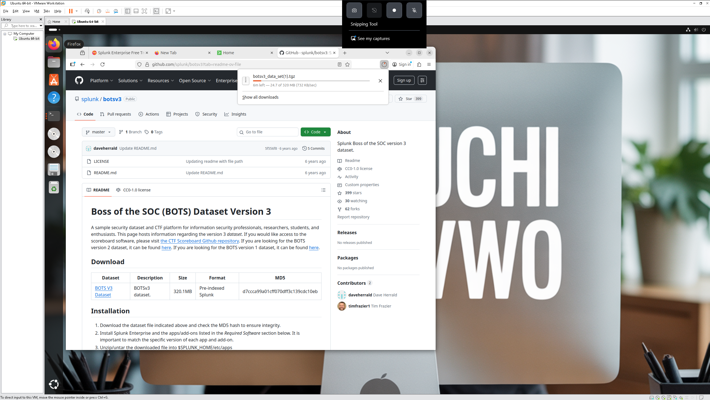
*Figure 5: BOTSv3 dataset download from GitHub*

The BOTSv3 dataset was downloaded separately and extracted locally. After extraction, the directory structure was checked to ensure it matched Splunk's expected application format, including `default`, `metadata`, and index configuration folders.

Due to permission restrictions, root access was required to copy the dataset into Splunk's applications directory. The dataset folders were copied into `/opt/splunk/etc/apps/`, ensuring that the correct file hierarchy was preserved. Once copied, Splunk was restarted to allow the dataset to be recognised and indexed.

After restarting Splunk, the dataset was verified through the Splunk web interface. The index name `botsv3` was selected, and the time range was set to "All time" to ensure all events were visible. A search confirmed that the dataset had been successfully indexed.

The total number of indexed events reached **2,083,056**, which matches the expected event count for the BOTSv3 dataset. This confirmed that the data ingestion process was completed successfully and that the environment was ready for investigation.

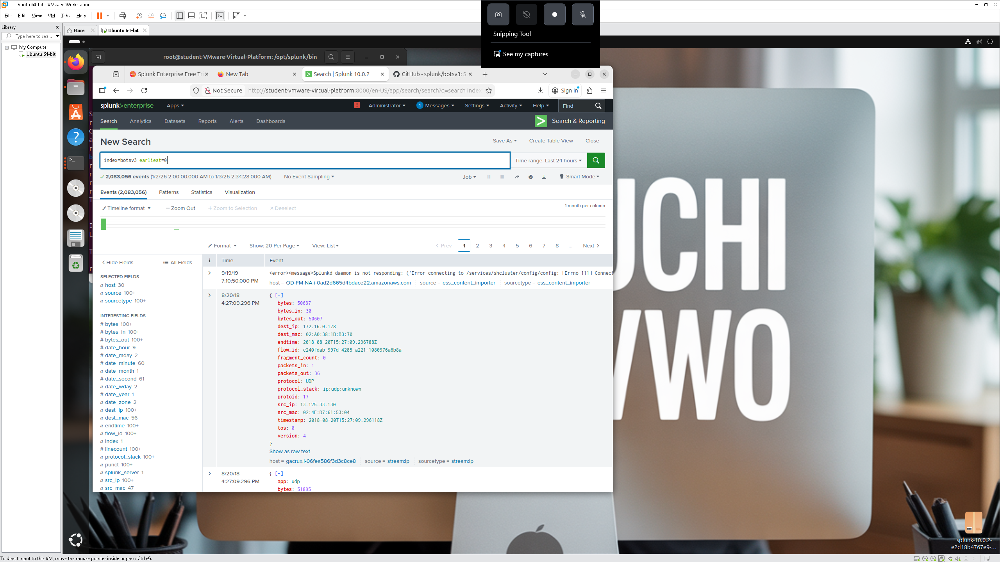
*Figure 6: Splunk web interface of BOTSv3 dataset*

---

## Section 4: Log Sources and Detection Mechanisms Used in the Investigation

This section explains the key logging mechanisms and telemetry sources used during the investigation. Rather than analysing attacker behaviour, it focuses on how events are generated, recorded, and made searchable in Splunk, forming the foundation for the forensic analysis presented in later sections.

### 4.1 Office 365 and OneDrive Activity Logging

Microsoft Office 365 generates detailed audit logs for user and administrative actions performed across its services, including OneDrive. These logs capture events such as file uploads, downloads, sharing activities, and access attempts.

Within Splunk, Office 365 audit data is indexed using the sourcetype:

```
ms:o365:management
```

Relevant fields recorded in these logs include:

- `Workload` – identifies the Office 365 service (e.g., OneDrive)
- `Operation` – describes the action performed (e.g., FileUploaded)
- `UserAgent` – identifies the client software used
- `src_ip` – source IP address of the activity
- `object` – the file or resource involved

This logging mechanism is critical for identifying initial infection vectors, such as malicious files or links uploaded to cloud storage services. The integrity of these logs makes them reliable for tracing attacker activity back to its origin.

### 4.2 SMTP Email Traffic and Malicious Attachment Detection

Email traffic is monitored and captured using Splunk Stream, which records SMTP-level communication between mail servers. These events are indexed under the sourcetype:

```
stream:smtp
```

SMTP logs contain metadata and content indicators such as:

- Email subject and sender information
- Attachment metadata
- Malware alert indicators generated by security controls
- Encoded attachment content

When a macro-enabled attachment is flagged as malicious, the system generates alert messages indicating that malware was detected and removed. This provides visibility into social engineering attempts, including phishing emails designed to deliver malicious documents.

These logs allow investigators to identify:

- The original delivery mechanism of malware
- The file names and formats used
- Indicators of compromise associated with email-based attacks

### 4.3 Sysmon Endpoint Telemetry (Windows Hosts)

Sysmon (System Monitor) is a Windows system service that provides enhanced visibility into endpoint activity. It logs detailed information about process execution, file creation, network connections, and hash values [6].

Sysmon data is indexed in Splunk under:

```
XmlWinEventLog:Microsoft-Windows-Sysmon/Operational
```

Key event types relevant to this investigation include:

- Process creation events (EventCode 1)
- Hash values (MD5, SHA1, SHA256)
- Command-line arguments
- Parent-child process relationships

Sysmon is essential for identifying:

- Executables launched by malicious documents
- Persistence mechanisms
- Tools used for lateral movement or network scanning

Because Sysmon records cryptographic hashes at execution time, it provides strong forensic evidence that supports malware identification and attribution.

### 4.4 Linux Authentication and Command Execution Logging

On Linux systems, authentication and user management activities are logged through system log files and Osquery telemetry. These logs capture actions such as user creation, privilege escalation, and command execution [7].

Relevant sources in Splunk include:

- Authentication logs recording user and privilege changes
- Osquery logs capturing executed commands and system state

Osquery provides structured telemetry that allows investigators to query endpoint behaviour in a SQL-like format. This is particularly useful for detecting:

- Unauthorized user creation
- Commands executed with elevated privileges
- Processes listening on suspicious ports

These logs are critical for identifying post-compromise persistence and attacker activity on Linux hosts.

### 4.5 Importance of Log Correlation in Incident Investigation

Each of the log sources described above provides partial visibility into attacker behaviour. When correlated within Splunk, they enable investigators to reconstruct the full attack lifecycle, from initial compromise to persistence and internal reconnaissance.

Knowledge of logging capabilities helped me validate evidence reliability, spot visibility gaps in the environment, and confidently link observed events to attacker actions rather than misconfigurations.

This foundation enables the detailed attack analysis presented in the following section.

---

## Section 5: Attack Analysis and Timeline Reconstruction

This section investigates the endpoint-level compromise observed in the BOTSv3 dataset, focusing on malware delivery via macro-enabled Microsoft documents, attacker persistence techniques, and post-exploitation activity. All analysis was conducted using Splunk Enterprise, pivoting across endpoint, email, authentication, and system monitoring logs.

### 5.1 Initial Access: Malicious File Delivery via OneDrive

The initial access phase of the attack was achieved through the upload of a malicious link file to Microsoft OneDrive. This activity was identified within Office 365 Unified Audit Logs, which are indexed in the BOTSv3 dataset under the `ms:o365:management` sourcetype. Since OneDrive is commonly used and trusted within enterprise environments, this technique allowed the attacker to leverage a legitimate cloud service to initiate the infection chain while bypassing traditional perimeter-based security controls.

To investigate this activity, Office 365 management logs were filtered to isolate OneDrive-related file upload events. Specifically, the analysis focused on events where the `Workload` field was set to OneDrive and the `Operation` field indicated a FileUploaded action. This approach allowed the investigation to narrow down the dataset to only file uploads that could plausibly represent the initial delivery mechanism.

**Splunk Query:**
```spl
index=botsv3 sourcetype=ms:o365:management Workload=OneDrive Operation=FileUploaded
| rename UserId AS user ClientIP AS src_ip SourceFileName AS object
| table _time UserAgent user src_ip Operation object
| sort + _time
```
*[View full query](queries/onedrive-file-upload.spl)*

Field renaming was applied to improve readability and align Office 365–specific field names with more conventional security terminology. This made it easier to interpret the results and correlate them with findings from other data sources.

Reviewing the results chronologically revealed a small subset of upload events involving a Windows shortcut (`.lnk`) file named **"BRUCE BIRTHDAY HAPPY HOUR PICS.lnk"**. This file had already been identified during earlier antivirus analysis as malicious, confirming its role as the initial infection vector.

Further examination of the upload event revealed the full user agent string associated with the activity:

```
Mozilla/5.0 (X11; U; Linux i686; ko-KP; rv: 19.1br) Gecko/20130508 Fedora/1.9.1-2.5.rs3.0 NaenaraBrowser/3.5b4
```

This user agent is highly unusual within a corporate Office 365 environment. It indicates the use of a non-standard browser running on a Linux-based system, rather than a typical enterprise workstation. The presence of such an anomalous user agent strongly suggests that the upload was performed by an attacker-controlled system rather than a legitimate user device.

Overall, this stage represents the initial access vector of the attack. By abusing a trusted cloud service such as OneDrive, the attacker was able to introduce a malicious file into the environment in a way that appeared legitimate, setting the foundation for subsequent stages of execution, persistence, and privilege escalation.

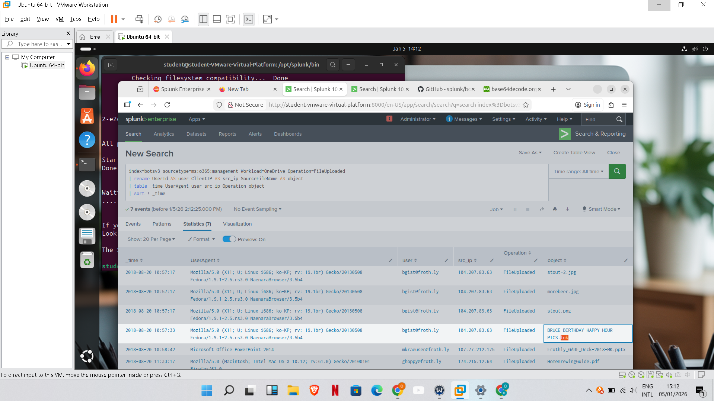
*Figure 7: OneDrive file upload event with suspicious user agent*

---

### 5.2 Payload Delivery: Phishing Email with Macro-Enabled Attachment

Following the initial access via OneDrive, the next stage of the attack involved the delivery of a phishing email containing a macro-enabled Microsoft Excel attachment. Email telemetry under the `stream:smtp` sourcetype revealed this delivery phase. These logs contained SMTP metadata including attachment details and malware alerts generated by Defender.

To begin the investigation, a broad search was performed to understand the volume and nature of email activity within the dataset:

**Initial Splunk Query:**
```spl
index=botsv3 sourcetype=stream:smtp
```

This initial query confirmed that SMTP data was present and allowed for exploration of relevant fields related to email attachments and alerts. To narrow the focus to potentially malicious activity, the search was refined by adding the keyword `*alert*`, which is commonly associated with emails flagged by security controls:

**Refined Splunk Query:**
```spl
index=botsv3 sourcetype=stream:smtp *alert*
```
*[View full query](queries/smtp-malware-detection.spl)*

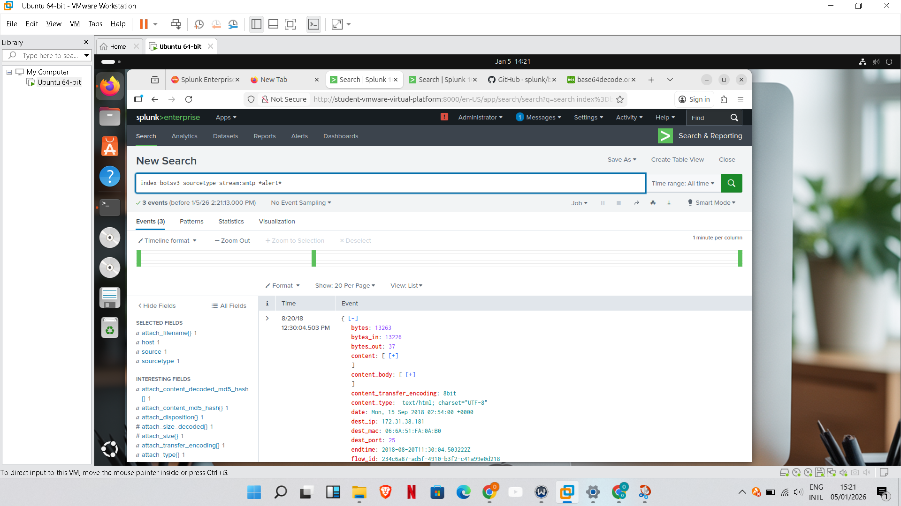
*Figure 8: Filtered SMTP events containing security alerts*

This refinement significantly reduced the dataset and highlighted events where attachments had been identified as malicious. From these results, the `attach_filename{}` field was examined, revealing a file named **"Malware Alert Text.txt"**. This file name is indicative of Microsoft Defender's behaviour when malicious attachments are detected and removed before delivery to the user.

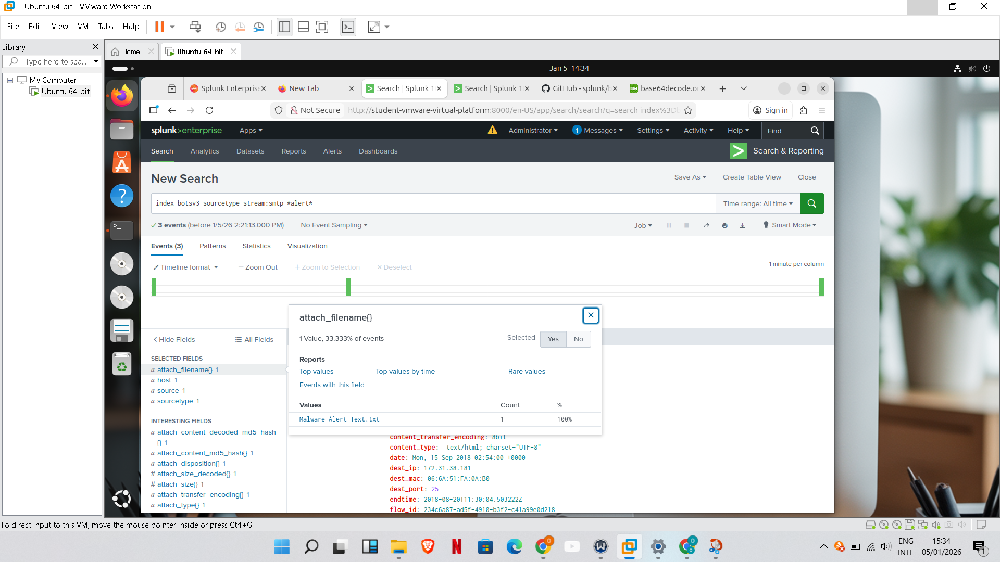
*Figure 9: attach_filename{} revealing a file named "Malware Alert Text.txt"*

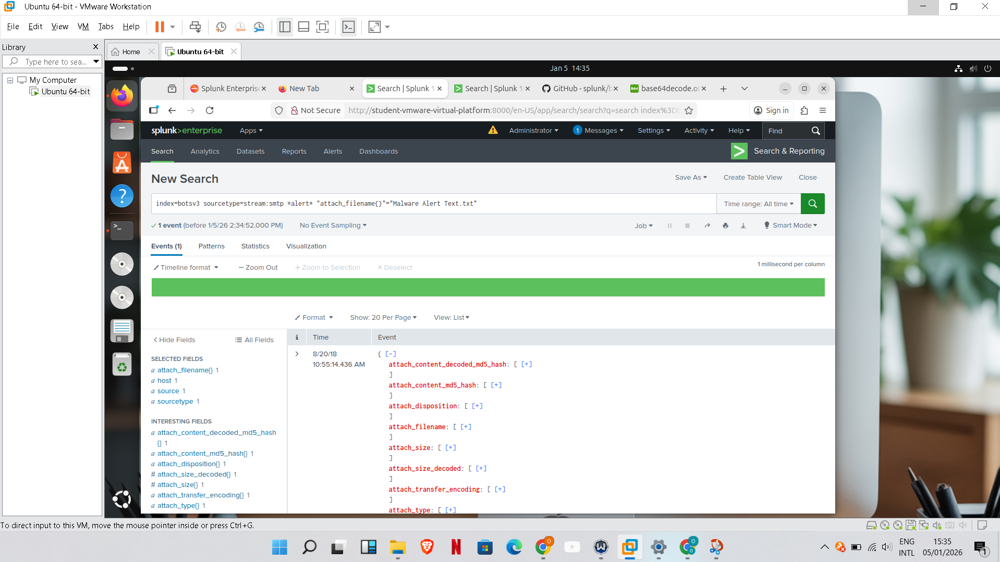
*Figure 10: Filtered SMTP events containing file named "Malware Alert Text.txt"*

Selecting this event and inspecting the raw email content revealed a Base64-encoded block located near the bottom of the event data. This encoded content represents a malware alert message generated by the email security system:

```
TWFsd2FyZSB3YXMgZGV0ZWN0ZWQgaW4gb25lIG9yIG1vcmUgYXR0YWNobWVudHMgaW5jbHVkZWQg
d2l0aCB0aGlzIGVtYWlsIG1lc3NhZ2UuIA0KQWN0aW9uOiBBbGwgYXR0YWNobWVudHMgaGF2ZSBi
ZWVuIHJlbW92ZWQuDQpGcm90aGx5LUJyZXdlcnktRmluYW5jaWFsLVBsYW5uaW5nLUZZMjAxOS1E
cmFmdC54bHNtCSBXOTdNLkVtcHN0YWdlDQo=
```

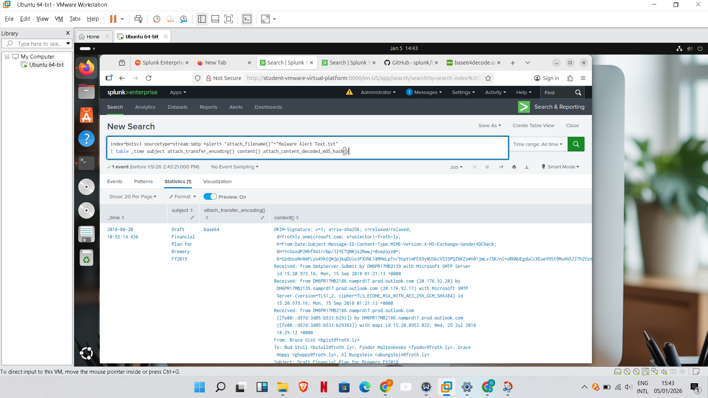
*Figure 11: Filtered SMTP events containing file named "Malware Alert Text.txt" - Table Scrolled Down*

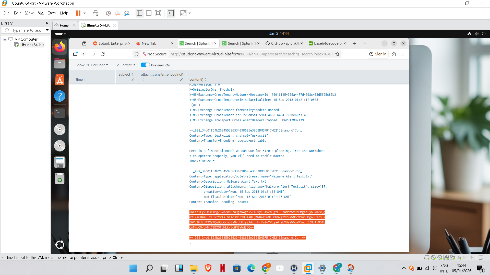
*Figure 12: Base64-encoded malware alert content within Splunk*

To interpret this content, the encoded string was copied and decoded using a Base64 decoding tool. The decoded output clearly confirmed the presence of a malicious macro-enabled attachment:

```
Malware was detected in one or more attachments included with this email message.
Action: All attachments have been removed.
Frothly-Brewery-Financial-Planning-FY2019-Draft.xlsm    W97M.Empstage
```

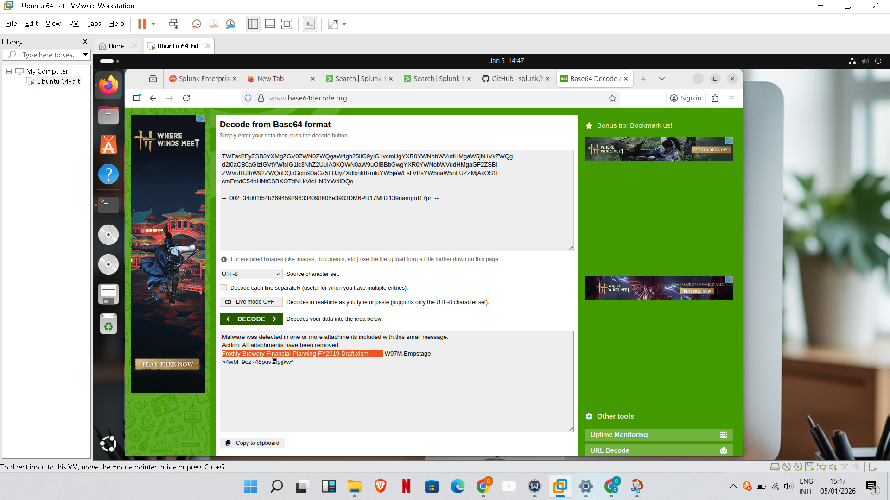
*Figure 13: Decoded Base64 output showing original attachment name*

This decoding step was critical, as Microsoft Defender replaces the original attachment with a generic alert file, meaning the true filename is not immediately visible without decoding the embedded alert content.

The decoded output revealed that the original attachment was named:

**Frothly-Brewery-Financial-Planning-FY2019-Draft.xlsm**

The `.xlsm` file extension confirms that this was a macro-enabled Microsoft Excel document. Additionally, the malware classification **W97M.Empstage** indicates a macro-based malware family, reinforcing the conclusion that this attachment was designed to execute malicious code once macros were enabled by the user.

This stage represents the payload delivery phase of the attack. The attacker relied on social engineering to convince the recipient to enable macros, thereby triggering execution of the embedded malicious logic. Combined with the earlier OneDrive upload, this demonstrates a multi-stage infection strategy that blends trusted cloud services with email-based delivery to increase the likelihood of successful compromise.

---

### 5.3 Execution: Embedded Malware and Process Launch

After identifying the malicious macro-enabled Excel attachment in the phishing email, the next step was to determine whether the macro executed any additional payload on the endpoint. To achieve this, Windows Sysmon process creation logs were analysed using Splunk. Sysmon provides detailed visibility into process execution, making it well suited for identifying malware launched by document-based attacks.

The investigation focused on events indexed under the following sourcetype, which records process creation and execution activity on Windows systems:

**Splunk Query:**
```spl
index=botsv3 sourcetype=XmlWinEventLog:Microsoft-Windows-Sysmon/Operational *xlsm*
| sort by +_time
```
*[View full query](queries/sysmon-xlsm-execution.spl)*

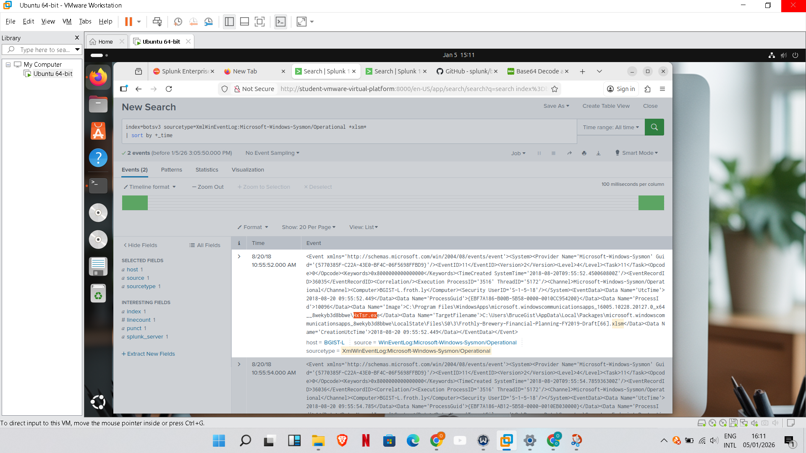
*Figure 14: Sysmon process creation events filtered for .xlsm activity*

This query was designed to identify any process execution events associated with macro-enabled Excel files, as `.xlsm` documents are commonly abused by attackers to execute malicious code. Sorting the results chronologically made it easier to correlate document execution with any subsequent processes launched.

Reviewing the earliest relevant events revealed that the macro-enabled file `Frothly-Brewery-Financial-Planning-FY2019-Draft[66].xlsm` was closely followed by the creation of a new process. Inspection of the Sysmon event fields, particularly the `Image` field, showed that the executable launched was:

**HxTsr.exe**


*Figure 15: Sysmon event showing execution of HxTsr.exe*

Further analysis of the process creation event confirmed a clear parent–child relationship between the Excel document and the newly executed binary. The timing of the events demonstrated that `HxTsr.exe` was launched immediately after the malicious document was opened, strongly indicating that the execution was triggered by the embedded macro.

Additionally, `HxTsr.exe` is not a legitimate or standard Microsoft Office component, further supporting the conclusion that this executable was malicious. Sysmon also recorded hash values and command-line execution details at runtime, providing strong forensic evidence that the binary was executed as part of the attack chain.

At this stage, the victim likely enabled macros in the Excel file, triggering execution of the embedded `HxTsr.exe` payload. The transition from a seemingly legitimate Excel document to the execution of a malicious binary demonstrates how macro-based phishing attacks can bypass initial security controls and achieve code execution on victim systems.

---

### 5.4 Linux Persistence: User Creation and Credential Discovery

Following the successful execution of malware on the Windows host, the investigation revealed that the attacker extended their activity to an on-premises Linux host, **hoth**, to establish persistence. The objective of this stage was to identify whether unauthorised user accounts were created and whether any credentials were exposed during the process. Based on the task requirements, analysis was scoped specifically to the Linux host hoth.

To investigate potential user creation activity, Osquery command execution logs were examined using Splunk. Knowledge of standard Linux user management was applied to guide the investigation, with particular attention paid to commands commonly used to create accounts, such as `useradd` and `adduser`.

**Initial Splunk Query:**
```spl
index=botsv3 host=hoth (adduser OR useradd)
```

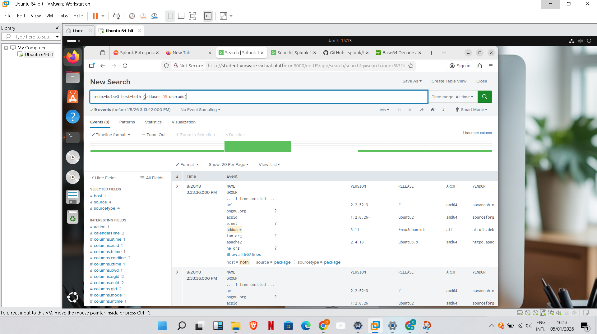
*Figure 16: host=hoth event*

**Refined Splunk Query:**
```spl
index=botsv3 host=hoth (adduser OR useradd) sourcetype="osquery:results"
```
*[View full query](queries/osquery-user-creation.spl)*

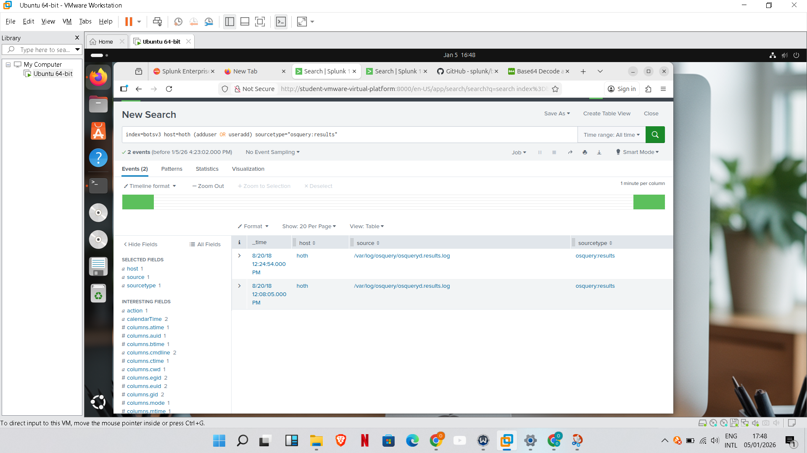
*Figure 17: Osquery events showing user account creation on host hoth*

This search returned a small number of relevant events, indicating successful filtering to genuine account creation activity. Examination of the event details confirmed that the command was executed by the root user, as shown by the `username` field and a user identifier (UID) value of 0, which represents full administrative privileges.

The event further recorded the command path `/usr/sbin/useradd` and an `action` value of `added`, confirming that a new user account was successfully created on the system.

Closer inspection of the `cmdline` field revealed the full command used:

```bash
useradd -ou tomcat7 -p ilovedavidverve 0 -g 0 -M -N -r -s /bin/bash
```

**Command Breakdown:**

| Flag | Meaning |
|------|---------|
| `useradd` | Create a new user |
| `tomcat7` | Username created |
| `-p ilovedavidverve` | Password (plaintext) |
| `-u 0` / `-o` | Same UID as root |
| `-g 0` | Root group |
| `-s /bin/bash` | Valid login shell |

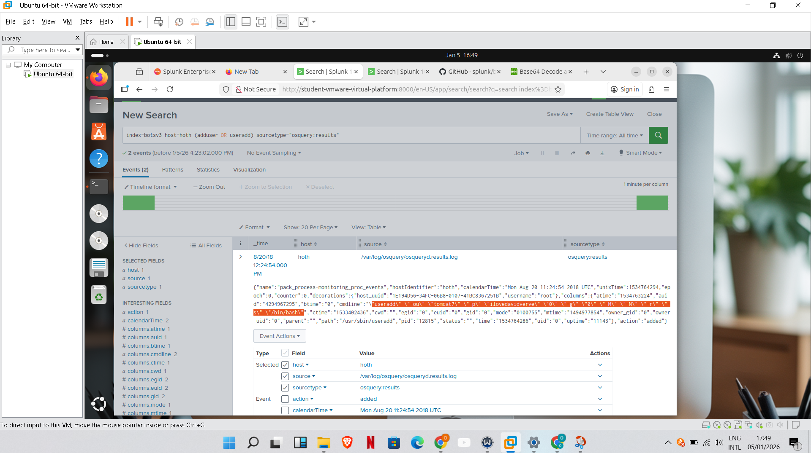
*Figure 18: Osquery log showing full command line with exposed password*

This command shows that a new account named `tomcat7` was created with root-level privileges. Most notably, the `-p` flag was used to assign a password at the time of account creation. Because Osquery records full command-line execution details, the password was captured in plaintext within the log.

The Osquery logs captured the password in plaintext:

**Password:** `ilovedavidverve`

This activity represents a clear persistence technique on the Linux host, where the attacker created a privileged backdoor account to maintain long-term access. The inclusion of the password directly in the command line also demonstrates poor operational security by the attacker, resulting in direct credential exposure that could be immediately leveraged during incident response and containment.

---

### 5.5 Privilege Escalation and Persistence: User Creation

As part of the post-compromise investigation, Windows Security logs were analysed to identify evidence of privilege escalation and persistence through the creation of unauthorised user accounts. This analysis focused on detecting new account creation events that could indicate an attacker establishing long-term access to the system.

To identify newly created users, Splunk was used to query Windows Security logs for Event ID 4720, which specifically records user account creation activity.

**Splunk Query:**
```spl
index=botsv3 source=wineventlog:security EventCode=4720
```
*[View full query](queries/windows-event-4720.spl)*

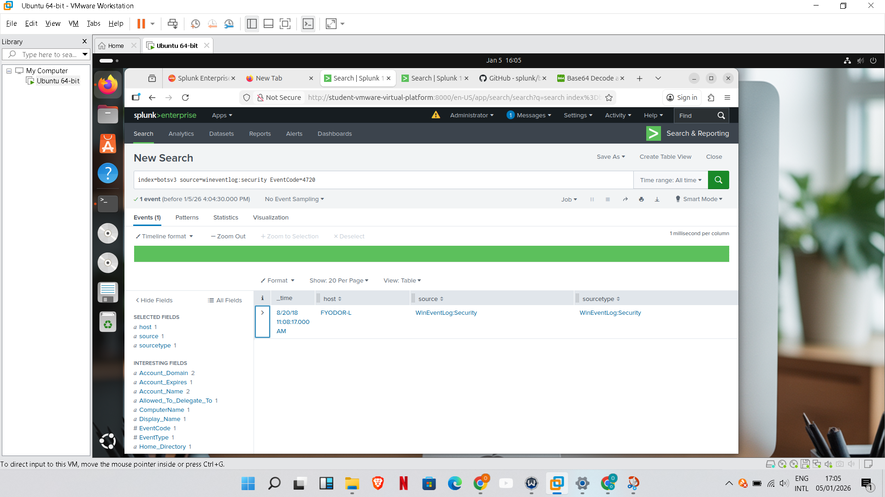
*Figure 19: Splunk results showing Event ID 4720 user creation events*

This search ensured that only security-relevant events related to account creation were returned. Examination of the event details revealed a suspicious account creation entry. Within the New Account section of the event, the following details were observed:

- **Account Name:** `svcvnc`
- **SAM Account Name:** `svcvnc`
- **Account Domain:** `FYODOR-L`

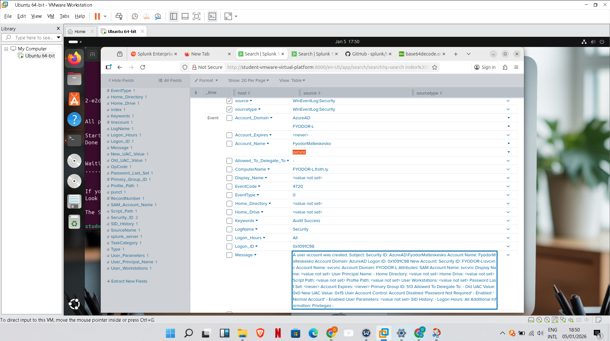
*Figure 20: Splunk results showing user creation events*

The matching Account Name and SAM Account Name confirmed that `svcvnc` was the newly created local user account. The timestamp of the event, **08/19/2018 at 22:08:17**, was reviewed and found to align with the post-compromise activity window, strengthening confidence that this account creation was malicious rather than administrative.


*Figure 21: Windows Security event showing New Account details for svcvnc*

To reduce noise and improve accuracy, optional filtering techniques such as excluding irrelevant hosts or searching for specific event message text were noted as effective methods for refining results during larger investigations.

Further analysis of related Windows Security events revealed that the newly created account did not remain a standard user. Subsequent group membership modification events (Event ID 4732) confirmed that the `svcvnc` account was added to both the **Users** and **Administrators** groups. This action granted the account elevated privileges, enabling full administrative access to the system.

The creation of an administrative-level user account represents a clear privilege escalation and persistence technique, allowing the attacker to maintain long-term access even if the original infection vector were removed. When combined with earlier findings on the Linux host, where a privileged user account was also created, this activity demonstrates a consistent attacker strategy of establishing persistent access across multiple operating systems within the environment.

---

### 5.6 Internal Reconnaissance: Network Scanning Activity

Following the creation of the unauthorised Windows user account `svcvnc`, further analysis was conducted to determine the level of access granted to the account after compromise. Establishing group membership is a critical step in understanding the attacker's capabilities, as elevated group assignments often enable internal reconnaissance, system control, and long-term persistence.

Windows Security logs were analysed using Splunk, focusing on Event ID 4732, which records events where a user is added to a local security group.

**Splunk Query:**
```spl
index=botsv3 sourcetype=wineventlog:security svcvnc EventCode=4732
```
*[View full query](queries/windows-event-4732.spl)*

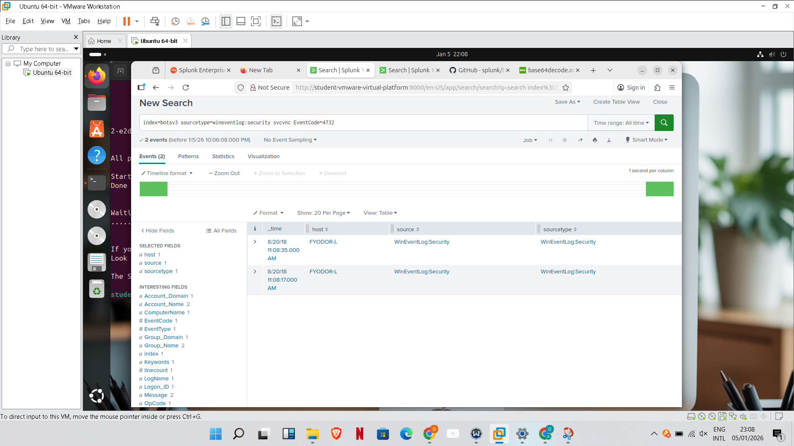
*Figure 22: Splunk results showing group membership modification events for svcvnc*


*Figure 23: Splunk results showing svcvnc event for Users*

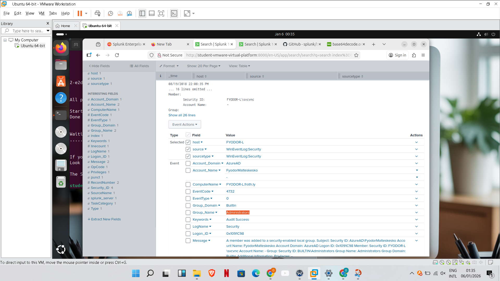
*Figure 24: Splunk results showing svcvnc event for Administrators*

This query filtered results to only include group assignment activity related to the `svcvnc` account. Examination of the event details revealed that the account was added to multiple local groups shortly after creation. The following group assignments were identified along with their associated timestamps:

| Group | Timestamp |
|-------|-----------|
| Administrators | 09/19/2018 22:08:35 |
| Users | 08/19/2018 22:08:17 |

The addition of `svcvnc` to the Users group represents the default access level for a newly created local account. However, its subsequent inclusion in the **Administrators** group is significantly more concerning. Membership in this group grants full administrative privileges, allowing unrestricted access to system resources, security settings, and installed services.

This elevated access would enable the attacker to perform internal reconnaissance, disable security controls, install additional tools, and maintain persistent control over the compromised host. The close timing between account creation and administrative group assignment further supports the conclusion that this activity was deliberate and malicious.

Documenting these group assignments and their timestamps was essential for reconstructing the attack timeline and assessing the overall impact of the compromise. When combined with earlier findings on unauthorised user creation across both Windows and Linux systems, this activity highlights a consistent attacker strategy focused on privilege escalation and long-term persistence within the environment.

---

### 5.7 Internal Reconnaissance: "Leet" Port Activity on Linux Host

As part of the internal reconnaissance phase, further analysis was carried out on the Linux host **hoth** to identify suspicious network services that may indicate attacker activity. During the investigation, the term "leet" was highlighted in the task. In cybersecurity contexts, "leet" is commonly associated with the numerical value **1337**, derived from "leet-speak" and frequently used by attackers as a non-standard or covert port number.
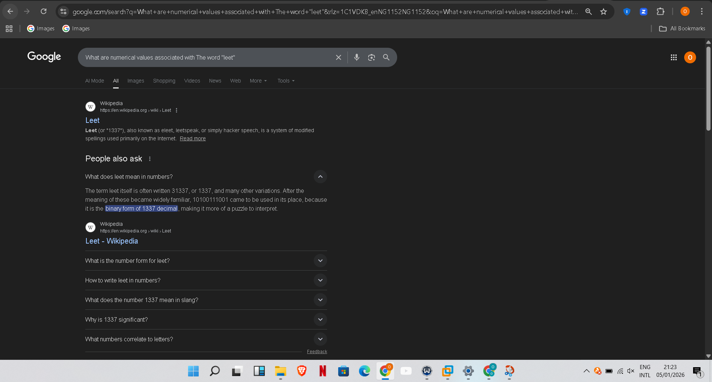
*Figure 25: Google Search of the meaning of the word "leet"*

I searched Osquery logs for any process bound to port 1337, since this 'leet' port number is commonly used by attackers. Since Osquery records detailed system and network telemetry from Linux hosts, it was selected as the most appropriate data source for this analysis.

**Initial Splunk Query:**
```spl
index=botsv3 1337 sourcetype=*osquery:results*
```

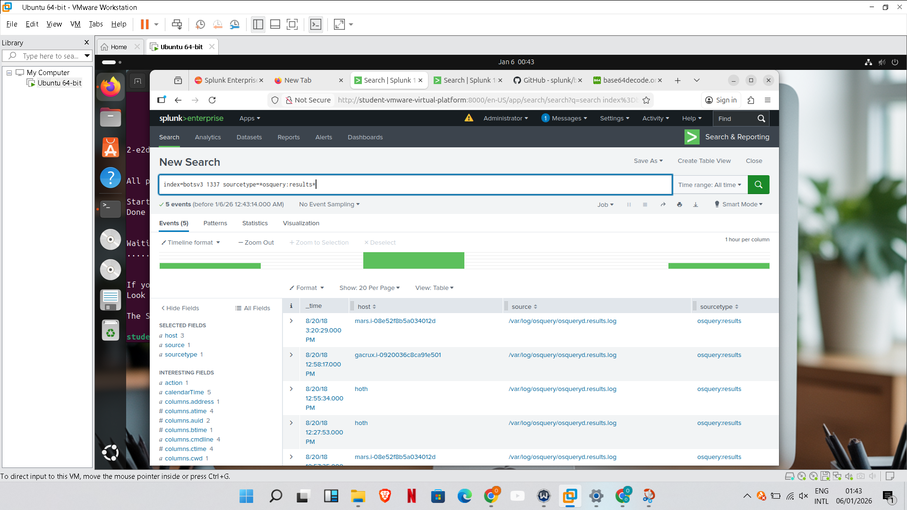
*Figure 26: Initial Osquery search showing multiple events related to "1337"*

As this query returned a high volume of events, the search was refined to focus specifically on open network ports by filtering on the `columns.port` field:

**Refined Splunk Query:**
```spl
index=botsv3 1337 sourcetype=*osquery:results* "columns.port"=1337
```
*[View full query](queries/osquery-port-1337.spl)*

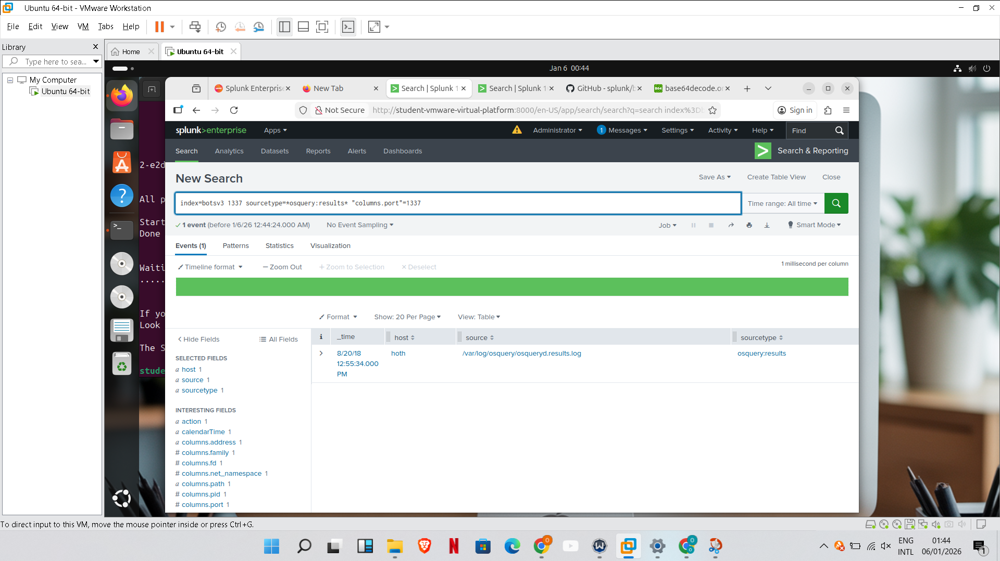
*Figure 27: Refined search highlighting processes listening on port 1337*

This refined query significantly reduced noise and allowed for precise identification of the relevant process. Examination of the resulting event revealed that a process was actively listening on port 1337 with the following attributes:

- **Process ID (PID):** `14356`
- **Timestamp:** `Mon Aug 20 11:55:34 2018`

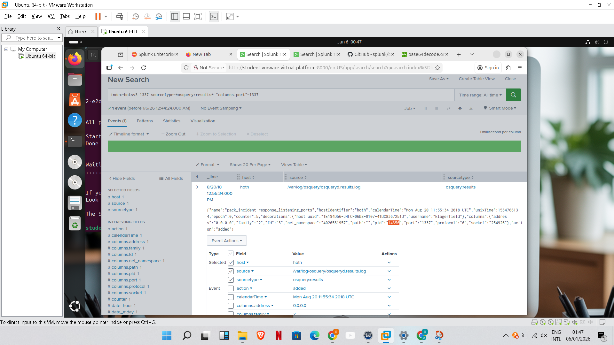
*Figure 28: Process ID (PID): 14356*

The presence of a service listening on port 1337 is notable, as this port is not typically used by legitimate services in enterprise Linux environments. Its association with "leet" further suggests intentional selection by an attacker, potentially for command-and-control communication or remote access.

By leveraging contextual knowledge, numerical keyword filtering, and field-specific searches, the investigation successfully identified the process responsible for activity on the "leet" port. This step demonstrates how targeted querying in Splunk, combined with Osquery telemetry, can efficiently uncover covert reconnaissance or persistence mechanisms within a compromised Linux system.

---

### 5.8 Malicious File Hash Identification

To identify malicious tooling used during post-compromise activity, Sysmon process creation logs were analysed on the Windows endpoint FYODOR-L. The objective of this stage was to determine whether any suspicious executables were launched and to extract file hash values that could be used as indicators of compromise.

The investigation began with a broad exploratory search across the botsv3 index to establish baseline activity on the affected host. The host was then filtered to FYODOR-L, followed by narrowing the dataset to Sysmon operational logs, which provide detailed visibility into process execution events.

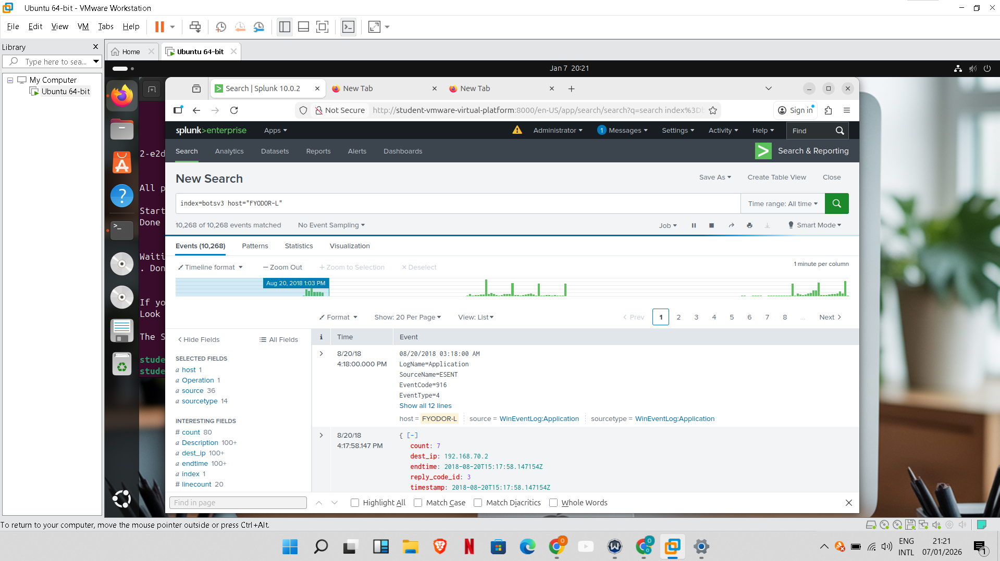
Figure 29: Sysmon Process Creation Logs 

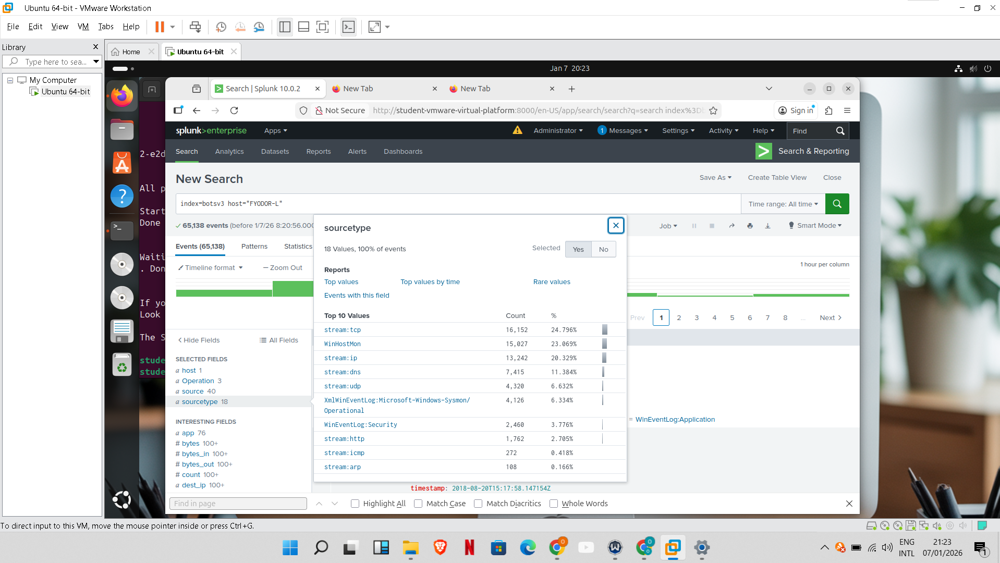
Figure 30: Sysmon Process Creation Logs 2

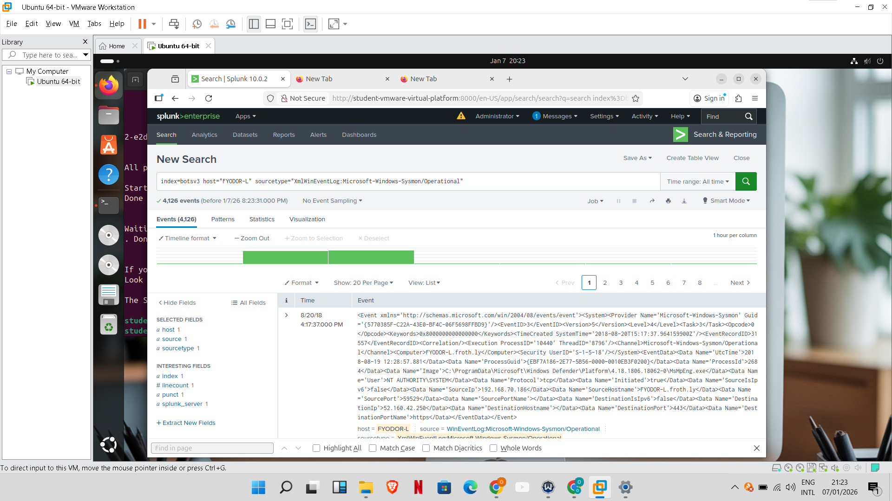
Figure 31: Sysmon Process Creation Logs 3

To focus specifically on process creation activity, the search was refined to Sysmon Event ID 1, which records newly created processes. This significantly reduced noise and ensured that only executable launches were examined.

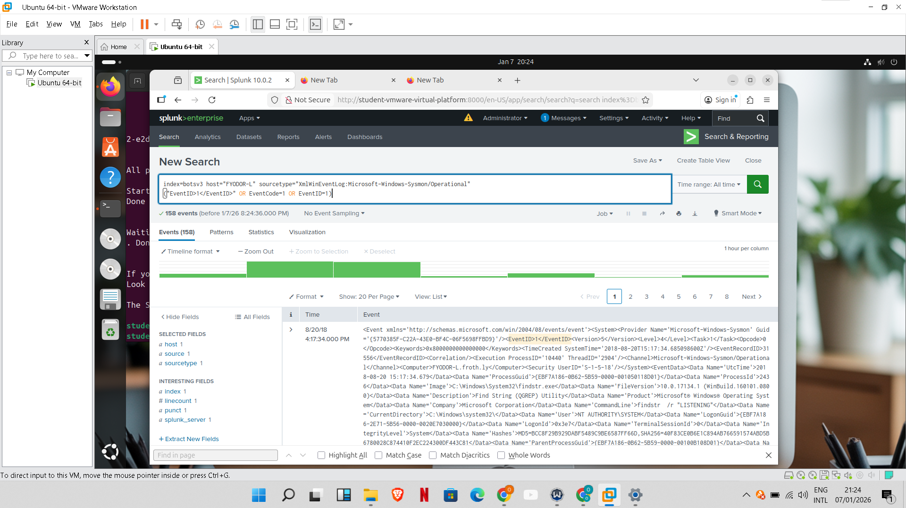
Figure 32: Sysmon EventID 1 Process Creation

The following SPL query was used to extract and summarise executed binaries:

index=botsv3 sourcetype="XmlWinEventLog:Microsoft-Windows-Sysmon/Operational" host="FYODOR-L" ("EventID>1</EventID>" OR EventCode=1 OR EventID=1)
| rex field=_raw "Data Name='Image'>(?<Image>[^<]+)"
| stats count by Image
| sort - count


Figure 33: Executed Images Frequency Analysis

This query parses the Image field from raw Sysmon XML data and counts how frequently each executable was launched. Sorting the results in descending order highlighted binaries that appeared most often, making it easier to spot anomalous or suspicious files.

Review of the results revealed the execution of an unusual binary located in a temporary directory:

C:\Windows\Temp\hdoor.exe

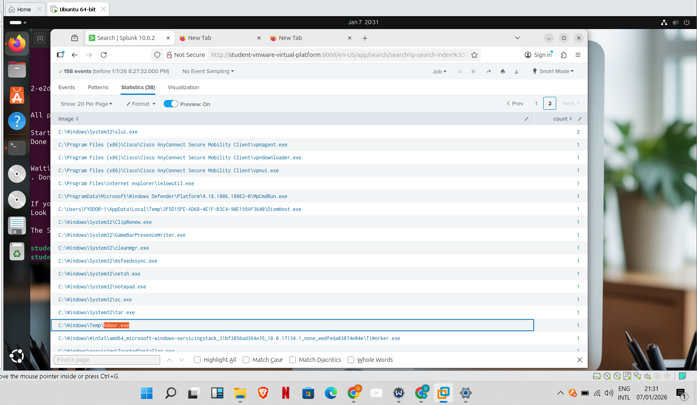
Figure 34: Suspicious Executable hdoor

The location of this file is notable, as temporary directories are commonly abused by attackers to store and execute malicious payloads in an attempt to evade detection.

Once the suspicious executable had been identified, a more targeted search was conducted to extract cryptographic hash information associated with hdoor.exe. The search was refined to include only events referencing this file, and regular expressions were used to extract hash values from the Sysmon Hashes field:

index=botsv3 sourcetype="XmlWinEventLog:Microsoft-Windows-Sysmon/Operational" host="FYODOR-L" EventID=1 hdoor.exe
| rex field=_raw "Data Name='Hashes'>(?<Hashes>[^<]+)"
| rex field=Hashes "MD5=(?<MD5>[A-Fa-f0-9]{32})"
| table _time MD5 Hashes

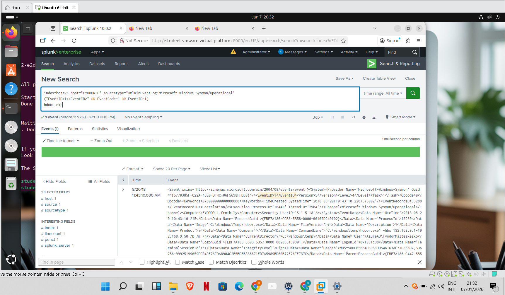
Figure 35: Hash Extraction hdoor

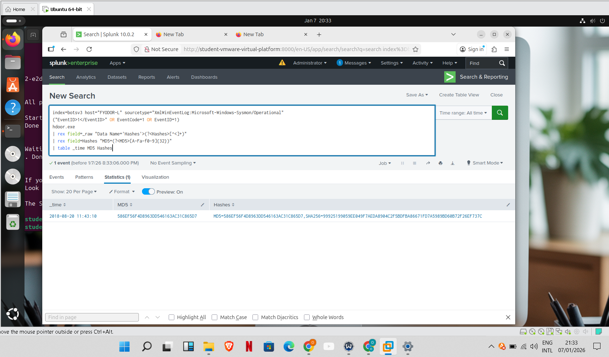
Figure 36: MD5 Hash Extraction hdoor

This analysis confirmed the following MD5 hash for the malicious executable:

MD5 Hash: 586EF56F4D8963DD546163AC31C865D7

Timestamp: 2018-08-20 11:43:10

The presence of hdoor.exe, executed from a temporary directory and associated with this hash, strongly indicates the use of a malicious scanning or reconnaissance tool. Extracting the hash enables defenders to enrich the indicator with threat intelligence, block the file across security controls, and search for its presence across other systems.

This phase of the investigation represents internal reconnaissance and preparation for lateral movement, further demonstrating how detailed endpoint telemetry and systematic filtering in Splunk can uncover attacker tooling and intent during post-exploitation activity.

---

### 5.9 Attack Timeline Reconstruction

Rather than viewing the incident as isolated technical events, the attack can be understood as a deliberate, multi-stage intrusion that followed a clear progression from initial access to persistence and internal reconnaissance.

The attacker first gained access by abusing a trusted cloud service — Microsoft OneDrive — to host and distribute a malicious link. This approach reduced suspicion and increased the likelihood of user interaction. Shortly afterwards, a phishing email containing a macro-enabled Excel attachment was delivered to the victim, relying on social engineering to convince the user to enable macros.

Once the document was opened and macros were enabled, the embedded malware executed successfully on the endpoint. Endpoint telemetry confirmed the launch of a malicious executable, marking the transition from user-driven compromise to full system-level control.

Following successful execution, the attacker focused on maintaining access. New user accounts were created on both Windows and Linux systems, and administrative privileges were deliberately assigned. This ensured persistence even if the original malware was discovered or removed.

Finally, evidence of network scanning and suspicious open ports indicated that the attacker had begun internal reconnaissance, likely preparing for lateral movement or further exploitation within the environment.

Together, these actions demonstrate a structured and intentional attack lifecycle rather than opportunistic malware activity.

#### Timeline Summary

| Stage | Description |
|-------|-------------|
| **Initial Access** | Malicious link uploaded to OneDrive |
| **Delivery** | Phishing email with macro-enabled Excel attachment |
| **Execution** | Embedded malware executed on endpoint |
| **Persistence** | Privileged user accounts created (Windows & Linux) |
| **Reconnaissance** | Network scanning and backdoor activity observed |

---

## Section 6: Recovery Actions, Business Impact & Lessons Learned

This section moves beyond detection and analysis to consider how the incident should be contained and remediated, the potential impact on business operations, and the key lessons identified from the investigation. These aspects are critical in real-world incident response, as they directly influence organisational resilience and future security posture.

### 6.1 Recovery and Containment Actions

Once the malicious activity was identified, immediate containment and recovery actions would be required to prevent further damage and limit attacker access. The first priority would be to isolate all affected endpoints from the network to prevent additional command execution, data access, or lateral movement to other systems.

All unauthorised user accounts created during the attack, including privileged backdoor accounts, should be disabled and permanently removed. As a precautionary measure, credentials associated with impacted systems should be reset, particularly where administrative privileges were involved. This helps to ensure that any compromised credentials cannot be reused by the attacker.

Malicious files and executables identified during the investigation should be securely removed from affected systems, followed by comprehensive endpoint scans to confirm that no additional persistence mechanisms remain. Identified indicators of compromise, including malicious file hashes, file paths, IP addresses, and abnormal user accounts, should be blocked across security controls such as endpoint protection platforms and SIEM correlation rules.

In addition, Microsoft Office macro execution policies should be reviewed and tightened, especially for documents originating from external or cloud-based sources. Enhanced logging and monitoring should also be enabled across endpoints and servers to improve visibility and support faster detection in future incidents.

Collectively, these actions aim to contain the incident, remove all attacker footholds, and restore trust in the affected systems.

### 6.2 Business and Operational Impact

Had this incident not been detected and investigated in a timely manner, the potential impact on the organisation could have been severe. The attacker's ability to execute code, escalate privileges, and create administrative user accounts suggests that critical systems and sensitive data may have been placed at risk.

Such access could lead to data breaches, unauthorised access to internal resources, service disruption, or the deployment of additional malware. The use of trusted platforms such as Microsoft OneDrive and Office significantly increases organisational risk, as these services are often permitted through security controls and may not initially raise suspicion.

Beyond technical consequences, a successful attack of this nature could result in reputational damage, loss of customer trust, and potential compliance or regulatory implications, particularly if personal or financial data were affected. Even in the absence of confirmed data exfiltration, the compromise of system integrity and administrative trust represents a serious operational and business concern.

### 6.3 Lessons Learned and Security Improvements

Several key lessons can be drawn from this incident. Firstly, cloud-based services and productivity tools are increasingly being abused by attackers and must be monitored with the same level of scrutiny as traditional on-premises infrastructure. Reliance on trusted platforms alone does not guarantee security.

Secondly, macro-enabled documents remain an effective and commonly used attack vector. Mitigating this risk requires a combination of technical controls, such as restrictive macro policies, and user awareness training to reduce the likelihood of malicious content being enabled.

The investigation also highlights the importance of strong endpoint visibility. Without detailed endpoint logging, post-exploitation activities such as privilege escalation, persistence, and credential exposure could easily go undetected.

Finally, this incident demonstrates the value of correlating multiple data sources during an investigation. No single log source provided a complete view of the attack; only by combining cloud, email, endpoint, and operating system logs was it possible to fully reconstruct the attacker's activity.

**Key security improvements include:**

- Enforcing least-privilege access policies
- Expanding endpoint monitoring coverage (Sysmon, Osquery)
- Strengthening macro and application execution controls
- Implementing Office 365 Advanced Threat Protection to scan OneDrive uploads
- Monitoring Event IDs 4720 and 4732 with SIEM correlation rules
- Implementing application whitelisting to prevent unauthorized executables
- Regularly training staff to recognise and report phishing attempts before malicious content is executed

---

## References

1. Hutchins, E. M., Cloppert, M. J., & Amin, R. M. (2011). *Intelligence-Driven Computer Network Defense Informed by Analysis of Adversary Campaigns and Intrusion Kill Chains*. Lockheed Martin Corporation. https://www.lockheedmartin.com/content/dam/lockheed-martin/rms/documents/cyber/LM-White-Paper-Intel-Driven-Defense.pdf

2. Cichonski, P., Millar, T., Grance, T., & Scarfone, K. (2012). *Computer Security Incident Handling Guide*. National Institute of Standards and Technology. NIST Special Publication 800-61 Revision 2. https://nvlpubs.nist.gov/nistpubs/SpecialPublications/NIST.SP.800-61r2.pdf

3. VMware. (2024). *VMware Workstation Pro Documentation*. https://docs.vmware.com/en/VMware-Workstation-Pro/

4. Splunk Inc. (2024). *Splunk Enterprise Documentation*. https://docs.splunk.com/Documentation

5. Splunk Inc. (2018). *Boss of the SOC Version 3 (BOTS v3) Dataset*. GitHub Repository. https://github.com/splunk/botsv3

6. Microsoft. (2024). *Sysmon - System Monitor*. Microsoft Sysinternals Documentation. https://learn.microsoft.com/en-us/sysinternals/downloads/sysmon

7. Kolide. (2024). *Osquery Documentation: About Osquery*. https://www.kolide.com/docs/about-kolide/the-kolide-agent/about-osquery

---

## Appendix: Indicators of Compromise (IoCs)

### Malicious Files

| Filename | Type | Hash (MD5) | Description |
|----------|------|-----------|-------------|
| BRUCE BIRTHDAY HAPPY HOUR PICS.lnk | Windows Shortcut | - | Initial malicious link uploaded to OneDrive |
| Frothly-Brewery-Financial-Planning-FY2019-Draft.xlsm | Macro-enabled Excel | - | Malicious Excel document with embedded macro |
| HxTsr.exe | Executable | - | Malware payload executed by macro |
| hdoor.exe | Executable | 586EF56F4D8963DD546163AC31C865D7 | Network scanning tool |

### Malicious User Accounts

| Username | System | Privileges | Password (if exposed) |
|----------|--------|------------|----------------------|
| tomcat7 | Linux (hoth) | UID 0 (root) | ilovedavidverve |
| svcvnc | Windows (FYODOR-L) | Administrators | - |

### Network Indicators

| Indicator | Type | Description |
|-----------|------|-------------|
| Port 1337 | Network Port | "Leet" port - Process listening on Linux host hoth (PID 14356) |

### Suspicious User Agent

```
Mozilla/5.0 (X11; U; Linux i686; ko-KP; rv: 19.1br) Gecko/20130508 Fedora/1.9.1-2.5.rs3.0 NaenaraBrowser/3.5b4
```

### Malware Classification

- **W97M.Empstage** - Macro-based malware family

---

## SPL Queries Repository

All Splunk queries used in this investigation are available in the [`queries/`](queries/) directory:

- [`onedrive-file-upload.spl`](queries/onedrive-file-upload.spl)
- [`smtp-malware-detection.spl`](queries/smtp-malware-detection.spl)
- [`sysmon-xlsm-execution.spl`](queries/sysmon-xlsm-execution.spl)
- [`osquery-user-creation.spl`](queries/osquery-user-creation.spl)
- [`windows-event-4720.spl`](queries/windows-event-4720.spl)
- [`windows-event-4732.spl`](queries/windows-event-4732.spl)
- [`osquery-port-1337.spl`](queries/osquery-port-1337.spl)

---

## Repository Structure

```
COMP5002-Incident-Analysis/
│
├── README.md                          # This report
├── images/                            # All investigation screenshots
│   ├── figure-01-vmware-ubuntu.png
│   ├── figure-02-terminal-download.png
│   ├── figure-03-splunk-port-8000.png
│   └── ... (all figures)
│
├── queries/                           # SPL queries used
│   ├── onedrive-file-upload.spl
│   ├── smtp-malware-detection.spl
│   ├── sysmon-xlsm-execution.spl
│   └── ... (all queries)
│
└── LICENSE                            # MIT License

```

---

## Author

**Module:** COMP5002 - Security Operations & Incident Management  
**Academic Year:** 2025/26  
**Assessment:** Coursework 2 – Incident Analysis

---

## Acknowledgments

- **Splunk Inc.** for providing the BOTSv3 dataset
- **NIST** for the SP 800-61 Incident Response framework
- **Lockheed Martin** for the Cyber Kill Chain methodology

---

## License

This project is submitted as academic coursework. All rights reserved.
